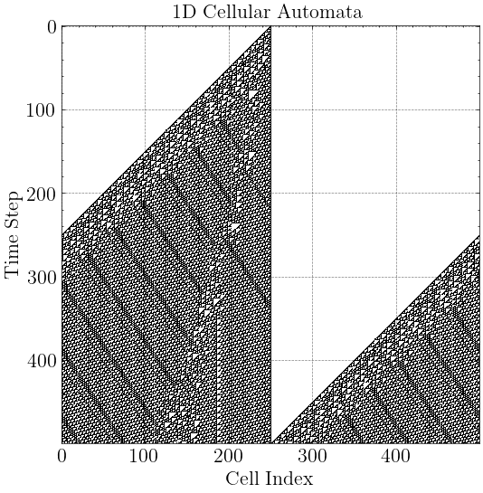
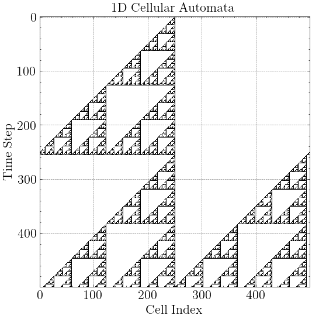
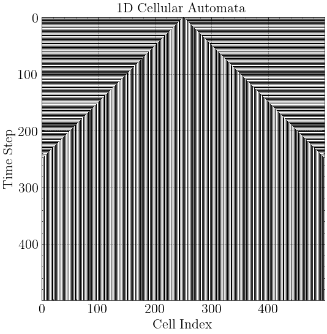
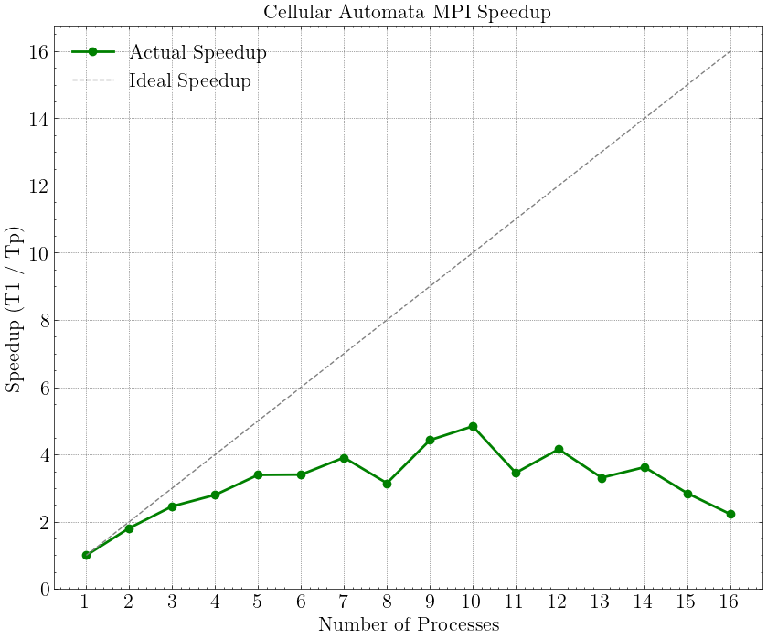

# HPC Homework 2 — MPI

Report covering the tasks:
`PingPong`, `Cellular Automata 1-d`.

## Environment

| | |
|---|---|
| CPU | Intel Core Ultra 9 285H, 16 physical cores, 1 thread/core |
| Compiler | gcc/g++ 13 |
| Framework | OpenMPI |
| Build | CMake, `-Wall -Wextra -Wpedantic -Werror` |

Build and run:
```sh
cmake -B build && cmake --build build

# Ping Pong Tasks
mpirun -n 4 ./build/PingPong
mpirun -n 2 ./build/PingPong2

# Automata Task (e.g. Rule 110, Static boundaries, 100 cells, 50 steps, print grid)
mpirun -n 4 ./build/Automata 110 --static 100 50 1
```

## Summary

| Task | Speedup (1 → 8 processes) |
|---|---|
| PingPong | n/a (Communication Bound) |
| Automata | **3.15×** |

---

## 1. Ping-Pong

### 1.1 Sequential Messages (Variable Length)
Source: [tasks/PingPong.cc](tasks/PingPong.cc)

Simulates the random passing of a message between processors. Each pass appends the receiver's rank, growing the message length. 
A unified event loop using `MPI_ANY_SOURCE` paired with `MPI_TAG` safely manages receiving randomly ordered messages until a final `TAG_DONE` broadcast cleanly terminates all ranks after exactly N passes.

### 1.2 Latency and Bandwidth (Fixed Length)
Source: [tasks/PingPong2.cc](tasks/PingPong2.cc)

To properly track scaling, this script measures Ping-Pong back-and-forth passes exactly 10,000 times between 2 ranks, isolating `MPI_Ssend` and `MPI_Recv` performance.

| Size (Bytes) | Time per pass (µs) | Bandwidth (MB/s) |
|---|---|---|
| 0 | 0.967 | 0.0 |
| 4 | 0.996 | 3.8 |
| 1024 | 0.727 | 1342.7 |
| 1048576 | 112.5 | 8882.9 |
| 4194304 | 421.0 | 9499.0 |

*Zero-byte latency (the absolute lowest overhead of the MPI layer) is approximately **0.96 µs** on this system.*

---

## 2. Cellular Automata 1-d

Source: [tasks/Automata.cc](tasks/Automata.cc)

Simulates 1-D Cellular Automata using bit-shifted Wolfram Rule Numbers (0-255). Supports periodic (circular) and static (zero) boundary conditions.

**Parallelization**: 
The computational domain is divided roughly evenly across ranks. Each rank provisions two additional **Ghost Cells** at its local array edges.
```cpp
// Left & Right internal boundary transfers
MPI_Sendrecv(&current[localSize], 1, MPI_INT, rightNeighbor, 0,
             &current[0], 1, MPI_INT, leftNeighbor, 0, ...);
MPI_Sendrecv(&current[1], 1, MPI_INT, leftNeighbor, 1,
             &current[localSize + 1], 1, MPI_INT, rightNeighbor, 1, ...);
```
At the start of every time step, processes exchange their overlapping edges. Once ghost cells are populated, the internal loop runs freely independent of the network.

### Interesting Outputs
Below are rendered visualizations of three popular outputs (Rule 110, Rule 102, and Rule 77):

<div>
  
  
  
</div>

### Speedup

Script: [scripts/benchmark_automata.sh](scripts/benchmark_automata.sh)

| processes | time (s) | speedup |
|---|---|---|
| 1  | 5.686 | 1.00× |
| 2  | 3.140 | 1.81× |
| 4  | 2.033 | 2.80× |
| 8  | 1.808 | 3.15× |
| 16 | 2.559 | 2.22× |

**Performance Note**: As the process count scales from 1 to 8, the problem nicely fragments, yielding a ~3.15x speedup. Beyond 8 processes on this machine, the message-passing synchronization overhead outpaces the arithmetic computation, resulting in a slowdown.


