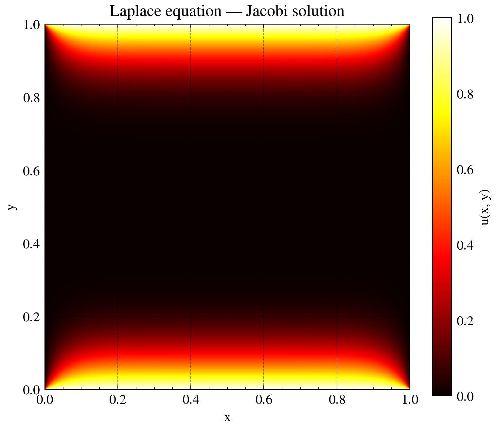
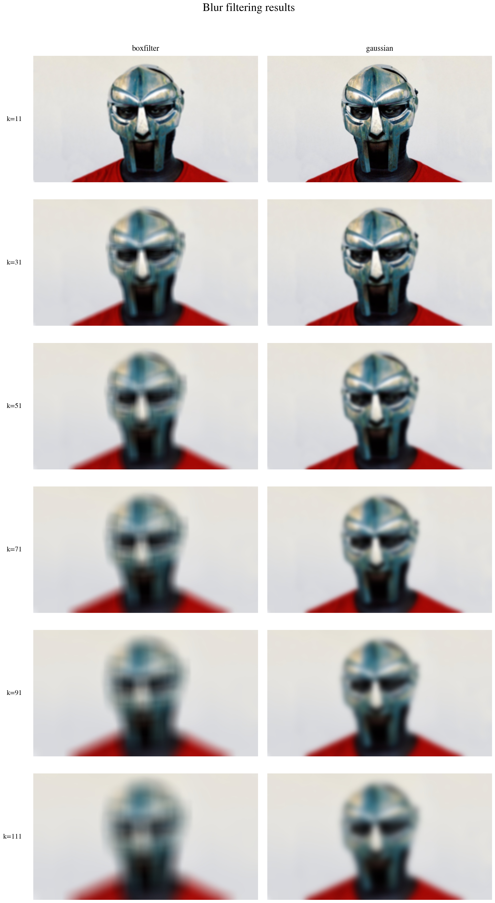
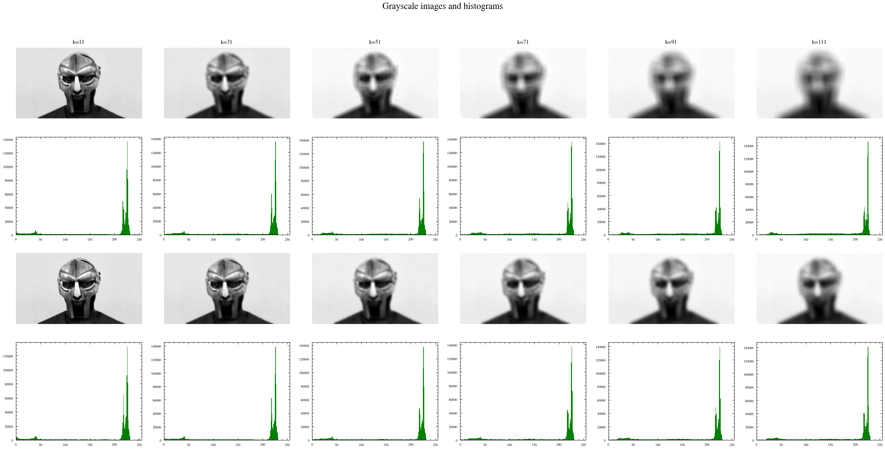

# HPC Homework 3 — CUDA

Report covering the tasks:
`Laplace equation`, `Image Filtering`, `Histogram`.

## Environment

| | |
|---|---|
| GPU | NVIDIA Tesla P100-PCIE, 16 GB |
| CUDA | 12.8 |
| Compiler | nvcc + g++ (C++20) |
| Build | CMake, `-Wall -Wextra -Wpedantic -Werror` |

Build and run:
```sh
cmake -B build && cmake --build build

./build/laplace
./build/filter
./build/histogram
```

---

## 1. Laplace Equation

Source: [tasks/laplace/](tasks/laplace/)

Solves the 2D Laplace equation on a unit square with fixed boundary conditions using the **Jacobi iterative method** on the GPU.

**Parallelization**: the domain is flattened to a 1D array. Each thread updates one grid point. Two device buffers are ping-ponged each iteration to avoid read/write conflicts. Convergence is checked via a per-block max-diff reduction kernel using shared memory, with the final max taken on the host.

The solution is exported to CSV and visualized as a heatmap:



---

## 2. Image Filtering

Source: [tasks/filter/](tasks/filter/)

Applies **box** and **Gaussian** blur filters to an image using 2D convolution on the GPU, for all odd kernel sizes from 11 to 111.

**Kernel**: each thread processes one output pixel across all 3 BGR channels. The convolution stencil is stored in `__constant__` memory. Border pixels are handled by clamping to the nearest edge pixel. The kernel weights are normalized on the host before upload via `cudaMemcpyToSymbol`.

Results:



---

## 3. Histogram

Source: [tasks/histogram/](tasks/histogram/)

Converts each blurred image to grayscale and computes its intensity histogram on the GPU.

**Grayscale**: each thread converts one BGR pixel using the standard luma coefficients `Y = 0.2126·R + 0.7152·G + 0.0722·B`.

**Histogram**: uses a **privatized** shared-memory approach. Each block maintains its own `__shared__ int localHist[256]`, accumulates pixel counts with `atomicAdd` into shared memory, then merges into the global histogram with one `atomicAdd` per bin per block — reducing global memory contention by a factor of the block size.

Grayscale images and their histograms:


