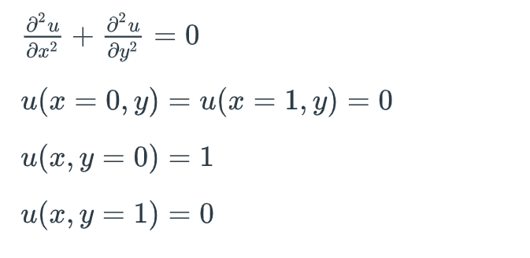

1) Laplace equation:  

- solve the Laplace equation using CUDA. (10 points)

- draw the heatmap of the solution u(x,y) using anything you want (10 points)

Here are the equation and the boundary conditions.
 

In principle you can use any of the 3 approaches:

- discretize the equation and get (NM)^2 sparse linear system and invert the matrix;

- discretize the equation and get (NM)^2 sparse linear system and solve it iteratively;

- try to achieve the steady-state solution of the corresponding heat equation with some initial conditions (solve until du/dt becomes approximately zero).

2) Filtering:

Take an arbitrary image and apply two types of filters to it using CUDA.

- Blurring filter (have at least 2 blurring filters - they can differ in stencil size or the values of the filter matrix for example) (15 points)

- Median filter (try to achieve the cartoonish effect) (15 points)

3) Histogram:

You need to plot a  histogram for a chosen picture. For this purpose:

- take any picture -> grayscale it -> calculate the histogram for the picture using CUDA (10 points)

- plot the resulting histogram using anything you want (10 points)